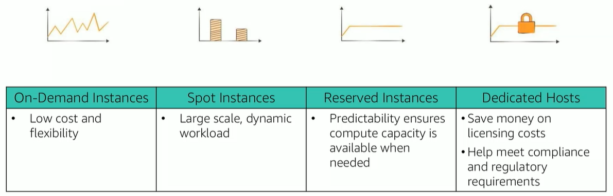

# Các Mô hình Định giá Amazon EC2 (Pricing Models)

Việc hiểu rõ các mô hình định giá của Amazon EC2 là yếu tố then chốt để tối ưu hóa chi phí khi triển khai hạ tầng trên đám mây. Dưới đây là chi tiết về 5 mô hình định giá phổ biến nhất:

---

## 1. On-Demand Instances (Máy chủ theo yêu cầu)
*Linh hoạt tối đa, thanh toán theo mức độ sử dụng thực tế.*

* **Khái niệm:** Giống như việc bạn thuê phòng khách sạn theo giờ. Bạn cần là có ngay, không cần đặt trước.
* **Chi phí:** Trả tiền theo từng giờ (hoặc từng giây) mà bạn mở máy chủ.
* **Đặc điểm:**
    * Không yêu cầu hợp đồng hay cam kết dài hạn.
    * Tắt máy là ngừng tính tiền.
    * Được áp dụng trong gói **AWS Free Tier** (Bậc miễn phí).
* **Phù hợp cho:** Ứng dụng mới phát triển, các dự án ngắn hạn, hoặc hệ thống có lưu lượng truy cập biến động khó dự đoán.

---

## 2. Reserved Instances (Máy chủ dự trữ)
*Cam kết dài hạn để nhận mức giá ưu đãi.*

* **Khái niệm:** Giống như ký hợp đồng thuê nhà dài hạn để hưởng giá thuê thấp hơn.
* **Chi phí:** Giảm giá đáng kể (lên đến 75%) so với On-Demand.
* **Hình thức thanh toán:**
    * **Full Upfront:** Trả trước toàn bộ (giảm giá nhiều nhất).
    * **Partial Upfront:** Trả trước một phần.
    * **No Upfront:** Không trả trước (trả góp hàng tháng).
* **Đặc điểm:** Cam kết sử dụng trong thời hạn **1 năm hoặc 3 năm**.
* **Phù hợp cho:** Các hệ thống lõi, cơ sở dữ liệu (Database), hoặc ứng dụng chạy 24/7 có mức độ sử dụng ổn định.

---

## 3. Spot Instances (Máy chủ đấu giá)
*Tận dụng tài nguyên dư thừa với mức giá rẻ nhất.*

* **Khái niệm:** AWS bán lại các máy chủ đang "nằm không" với giá cực kỳ rẻ.
* **Chi phí:** Tiết kiệm lên tới **90%** so với On-Demand.
* **Đặc điểm:**
    * **Rủi ro:** Có thể bị AWS thu hồi bất cứ lúc nào nếu họ cần tài nguyên cho khách hàng On-Demand hoặc giá thị trường vượt mức bạn đặt.
    * **Cảnh báo:** Hệ thống sẽ thông báo trước **2 phút** trước khi máy chủ bị dừng (stopped) hoặc hủy (terminated).
* **Phù hợp cho:** Xử lý dữ liệu lớn (Big Data), Render video, Training Machine Learning, hoặc các công việc có khả năng tự phục hồi và chịu lỗi cao.

---

## 4. Scheduled Reserved Instances (Dự trữ theo lịch trình)
*Tối ưu cho các công việc có chu kỳ thời gian cố định.*

* **Đặc điểm:** Một biến thể của Reserved Instances, cho phép bạn đặt trước tài nguyên để chạy vào một khung giờ lặp lại định kỳ (ví dụ: chỉ chạy từ 8:00 đến 17:00 hàng ngày).
* **Cam kết:** Thời hạn 1 năm.

---

## 5. Dedicated Resources (Tài nguyên dành riêng)
*Dành cho các yêu cầu đặc biệt về bảo mật và giấy phép.*

Thông thường, EC2 chạy trên phần cứng dùng chung (Multi-tenant). Nếu bạn cần sự riêng tư tuyệt đối:

* **Dedicated Hosts (Máy chủ vật lý dành riêng):** Thuê trọn một máy chủ vật lý. Phù hợp để tận dụng các giấy phép phần mềm (BYOL) hoặc tuân thủ quy định pháp lý khắt khe.
* **Dedicated Instances (Instance dành riêng):** Chạy trên phần cứng không chia sẻ với khách hàng khác, nhưng có thể chia sẻ với các instance khác trong cùng tài khoản của bạn.

---

### 💡 Lưu ý về Đơn vị tính tiền (Per-Second Billing)
AWS hỗ trợ **tính tiền chi tiết đến từng giây** cho các mô hình On-Demand, Reserved và Spot.
* **Điều kiện:** Áp dụng cho các máy chủ chạy hệ điều hành mã nguồn mở như **Amazon Linux** hoặc **Ubuntu**.
* **Lợi ích:** Giúp tối ưu hóa chi phí đến mức tối đa, đặc biệt hiệu quả với các tác vụ chạy trong thời gian cực ngắn.

# 4 Trụ Cột Tối Ưu Hóa Chi Phí (4 Pillars of Cost Optimization)

Để quản lý chi phí hiệu quả trên AWS, bạn cần nắm vững 4 chiến lược cốt lõi dưới đây. Việc áp dụng linh hoạt các trụ cột này giúp hệ thống vừa đạt hiệu suất cao, vừa tiết kiệm ngân sách tối đa.

---

## 🏗️ Trụ cột 1: Right Sizing (Chọn đúng kích cỡ)
*Nguyên tắc: Chỉ thuê những gì bạn thực sự cần.*

* **Cung cấp Instance phù hợp với nhu cầu:**
    * Cân đối chính xác các thông số: **CPU, Memory (Bộ nhớ), Storage (Lưu trữ)** và **Network Throughput (Băng thông mạng)**.
    * Tránh tình trạng "Over-provisioning" (thuê máy cấu hình quá cao nhưng chỉ dùng 10%).
* **Sử dụng đúng loại Instance:** Lựa chọn giữa các dòng tối ưu CPU (C-series), tối ưu RAM (R-series) hoặc mục đích chung (M-series) tùy vào mục đích sử dụng.
* **Theo dõi qua Amazon CloudWatch:** Sử dụng các chỉ số (metrics) để xác định xem các instance hiện tại có đang bị lãng phí tài nguyên hay không.

---

## 📈 Trụ cột 2: Increase Elasticity (Tăng tính đàn hồi)
*Nguyên tắc: Hệ thống tự động co giãn theo thực tế.*

* **Tạm dừng khi không sử dụng:** Tận dụng tính năng **Stop** hoặc **Hibernate** (ngủ đông) đối với các máy chủ EBS-backed instances khi không có nhu cầu sử dụng (ví dụ: tắt môi trường Dev/Test vào cuối tuần).
* **Tự động hóa quy mô (Auto Scaling):** Sử dụng **AWS Auto Scaling** để tự động thêm máy chủ khi lượng truy cập tăng và giảm bớt máy chủ khi thấp điểm.

---

## 💰 Trụ cột 3: Optimal Pricing Model (Mô hình giá tối ưu)
*Nguyên tắc: Kết hợp thông minh các phương thức thanh toán.*

* **Lựa chọn mô hình phù hợp:** Tận dụng On-Demand, Reserved Instances (RI), hoặc Spot Instances dựa trên đặc thù công việc (như đã phân tích ở phần trước).
* **Kết hợp các loại hình mua hàng:** Phối hợp giữa RI cho các ứng dụng chạy ổn định và Spot Instances cho các tác vụ xử lý hàng loạt để giảm giá thành tổng thể.
* **Giải pháp Serverless (AWS Lambda):** Chuyển dịch sang mô hình không máy chủ. Với Lambda, bạn chỉ trả tiền khi code thực sự chạy, loại bỏ hoàn toàn chi phí lãng phí cho thời gian máy chủ chờ.

---

## 💾 Trụ cột 4: Optimize Storage (Tối ưu hóa lưu trữ)
*Nguyên tắc: Lưu trữ đúng chỗ, đúng giá.*

* **Duy trì hiệu suất với chi phí thấp nhất:** Đảm bảo tính sẵn sàng nhưng không trả tiền cho không gian trống không cần thiết.
* **Quản lý EBS Volumes:**
    * **Resize:** Điều chỉnh dung lượng ổ đĩa phù hợp với lượng dữ liệu thực tế.
    * **Change Types:** Thay đổi loại ổ đĩa (ví dụ từ SSD sang HDD hoặc từ gp3 sang st1) dựa trên tần suất truy cập dữ liệu.
* **Dọn dẹp Snapshot:** Xóa bỏ các bản sao lưu (EBS Snapshots) đã lỗi thời hoặc không còn giá trị sử dụng.
* **Phân loại dữ liệu:** Xác định đúng "điểm đến" cho dữ liệu (ví dụ: dữ liệu ít dùng nên chuyển vào S3 Glacier thay vì lưu trên EBS).

---

### 💡 Lời khuyên
Tối ưu hóa chi phí không phải là công việc làm một lần. Đó là một **vòng lặp liên tục**: Theo dõi (CloudWatch) -> Phân tích -> Điều chỉnh (Right size/Elasticity) -> Kiểm tra lại.